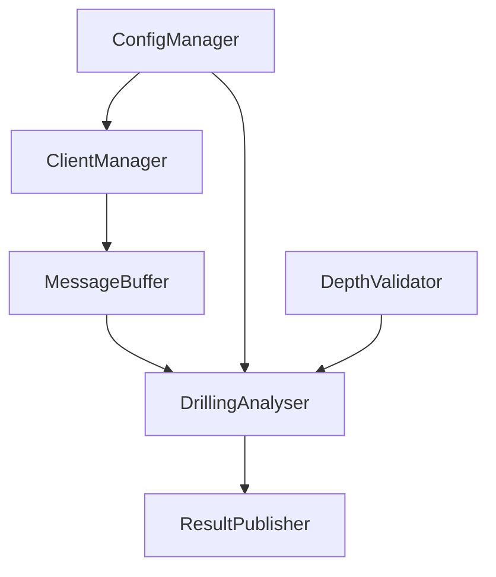

# Developer Workflow Guide

This guide covers development workflows, best practices, and common tasks for contributors to the UOS Drilling Depth Estimation System.

## Quick Start for Developers

### 1. Initial Setup
```bash
# Clone and navigate to project
cd /path/to/uos-drilling-wh

# Install development dependencies
make dev-install

# Verify installation
make test
```

### 2. Development Environment
```bash
# Start development session
cd abyss/
make dev-install  # Install in editable mode

# Run tests
make test

# Check code quality
make lint
```

## Development Workflows

### 🔄 Daily Development Cycle

```bash
# 1. Start with tests
make test

# 2. Make your changes to source code
# ... edit files in abyss/src/abyss/ ...

# 3. Run tests frequently
cd abyss && python -m pytest tests/unit/ -v

# 4. Build and validate
make build

# 5. Test with Docker (if needed)
make docker-main
```

### 🧪 Testing Strategy

#### Running Tests
```bash
# All tests
make test

# Specific test categories
cd abyss/
python -m pytest tests/unit/ -v           # Unit tests
python -m pytest tests/integration/ -v    # Integration tests
python -m pytest tests/performance/ -v    # Performance tests

# Specific test file
python -m pytest tests/mqtt/components/test_message_buffer.py -v

# With coverage
python -m pytest tests/ --cov=src/abyss --cov-report=html
```

#### Test Organization
- **Unit tests**: `abyss/tests/unit/` - Fast, isolated component tests
- **Integration tests**: `abyss/tests/integration/` - Component interaction tests  
- **Performance tests**: `abyss/tests/performance/` - Load and throughput tests
- **MQTT tests**: `abyss/tests/mqtt/` - MQTT-specific functionality

### 🏗️ Build and Package Management

#### Python Package Development
```bash
# Install for development (editable mode)
make dev-install

# Build wheel
make build

# Clean build artifacts
make clean

# Validate package
make validate
```

#### Docker Development
```bash
# Build main image for testing
make docker-main

# Build all images
make docker-all

# Clean Docker artifacts
make docker-clean

# Monitor build cache usage
make docker-cache-info
```

### 🔧 Code Quality and Standards

#### Automated Checks
```bash
# Lint code
cd abyss && make lint

# Format code
cd abyss && make format

# Type checking (if mypy available)
mypy src/abyss --ignore-missing-imports
```

#### Pre-commit Checklist
- [ ] Tests pass: `make test`
- [ ] Code builds: `make build`
- [ ] Docker builds: `make docker-main`
- [ ] Linting passes: `cd abyss && make lint`
- [ ] No sensitive data in commits

## Architecture and Design

### 🏛️ System Architecture

The system follows a **modular microservice architecture**:

```
MQTT Data Flow:
Data → ClientManager → MessageBuffer → DrillingAnalyser → ResultPublisher → MQTT Topics
```

Key components:
- **ClientManager**: MQTT connection and message handling
- **MessageBuffer**: Thread-safe message queuing and correlation
- **DrillingAnalyser**: Core depth estimation processing
- **ResultPublisher**: Results formatting and publishing

### 📦 Package Structure

```
abyss/src/abyss/
├── mqtt/components/          # Modular MQTT system
├── run/                      # Entry points and scripts
├── legacy/                   # Deprecated code (reference only)
└── *.py                      # Core modules
```

### 🔗 Component Dependencies



## Common Development Tasks

### 🆕 Adding New Features

#### 1. MQTT Component Development
```bash
# 1. Create new component
touch abyss/src/abyss/mqtt/components/my_component.py

# 2. Add tests
touch abyss/tests/mqtt/components/test_my_component.py

# 3. Update configuration (if needed)
# Edit: abyss/src/abyss/run/config/mqtt_conf_*.yaml

# 4. Test integration
python -m pytest tests/integration/ -k my_component
```

#### 2. Adding Configuration Options
```bash
# 1. Update config schema
# Edit: abyss/src/abyss/mqtt/components/config_manager.py

# 2. Update example configs
# Edit: abyss/src/abyss/run/config/mqtt_conf_*.yaml

# 3. Add validation tests
# Edit: abyss/tests/test_comprehensive_config_manager.py
```

### 🐛 Debugging Common Issues

#### MQTT Connection Issues
```bash
# Check broker connectivity
docker run --rm -it efrecon/mqtt-client sub -h <broker_host> -t "test/topic"

# Test with local broker
cd mqtt-multistack/mqtt-broker/
docker-compose up -d

# Debug MQTT client
python -c "
import abyss.mqtt.components.client_manager as cm
client = cm.MQTTClientManager()
client.connect('localhost', 1883)
"
```

#### Performance Issues
```bash
# Run performance tests
cd abyss/
python -m pytest tests/performance/test_throughput_monitoring.py -v -s

# Profile with cProfile
python -m cProfile -o profile.stats your_script.py
python -c "import pstats; pstats.Stats('profile.stats').sort_stats('cumulative').print_stats(20)"
```

#### Build Issues
```bash
# Clean everything and rebuild
make clean-all
make build

# Debug Docker build issues
make docker-main-fresh  # Force rebuild without cache

# Check Docker BuildKit
export DOCKER_BUILDKIT=1
docker info | grep BuildKit
```

### 🚀 Deployment Testing

#### Local Testing Stack
```bash
# Deploy test stack
cd mqtt-multistack/test-deployment/
./deploy-test-stack.sh

# Monitor logs
docker service logs -f mqtt-test_uos-depthest-listener-cpu

# Collect and analyze logs
./deploy-test-stack.sh --logs-only
```

#### Production Deployment Prep
```bash
# Validate configuration
python -c "
import yaml
with open('abyss/src/abyss/run/config/mqtt_conf_docker.yaml') as f:
    config = yaml.safe_load(f)
print('Config loaded successfully')
"

# Test Docker images
make test-publisher
make test-publisher-lightweight

# Performance validation
cd mqtt-multistack/test-deployment/
# ... run load tests ...
```

## Best Practices

### 🎯 Development Guidelines

#### Code Style
- **Follow existing patterns**: Study similar components before implementing
- **Modular design**: Keep components focused and loosely coupled  
- **Configuration-driven**: Use YAML configs instead of hardcoded values
- **Comprehensive testing**: Unit + integration + performance tests
- **Logging**: Use structured logging with appropriate levels

#### Git Workflow
```bash
# Feature branch workflow
git checkout -b feature/your-feature-name
# ... make changes ...
git add .
git commit -m "feat: descriptive commit message"

# Before pushing
make test
make build
make docker-main

git push origin feature/your-feature-name
# ... create pull request ...
```

#### Performance Considerations
- **Threading**: Use thread-safe components for MQTT processing
- **Memory**: Monitor buffer sizes and implement backpressure
- **Caching**: Leverage Docker BuildKit for fast builds (90% time savings)
- **Monitoring**: Add metrics for throughput and error rates

### 🔒 Security Best Practices
- **No secrets in code**: Use environment variables or secure configs
- **Input validation**: Validate all external inputs (MQTT messages, configs)
- **Error handling**: Don't expose internal details in error messages
- **Dependencies**: Keep dependencies updated and minimal

### 📊 Monitoring and Observability
- **Structured logging**: Use JSON logging for production
- **Metrics collection**: Track message rates, processing times, errors
- **Health checks**: Implement health endpoints for containers
- **Distributed tracing**: Use correlation IDs for request tracking

## Troubleshooting Guide

### 🔍 Common Issues and Solutions

| Issue | Symptoms | Solution |
|-------|----------|----------|
| **Paho MQTT v2 compatibility** | `TypeError: takes 3 positional arguments but 5 were given` | Update callback signatures to 5 parameters |
| **Docker build failures** | Out of space, network timeouts | Use `make docker-cache-clean`, check network |
| **Test failures** | Import errors, missing fixtures | Run `make dev-install`, check test data |
| **Performance degradation** | High latency, dropped messages | Check buffer sizes, thread pool configuration |
| **Configuration errors** | Invalid YAML, missing keys | Validate with `python -c "import yaml; yaml.safe_load(open('config.yaml'))"` |

### 📞 Getting Help
1. **Check documentation**: [`.devnotes/`](.devnotes/) for comprehensive docs
2. **Run diagnostics**: `make test` and `make build` to identify issues
3. **Review logs**: Enable DEBUG logging for detailed information
4. **Test in isolation**: Use unit tests to isolate component issues

## Advanced Topics

### 🧩 Extending the Architecture

#### Adding New MQTT Components
1. **Create base class**: Inherit from existing component patterns
2. **Implement interfaces**: Follow established method signatures  
3. **Add configuration**: Extend config schema and validation
4. **Write tests**: Unit, integration, and performance tests
5. **Update documentation**: Add to MQTT_ARCHITECTURE.md

#### Custom Data Processors
```python
# Example: Custom drill data processor
class CustomDrillingProcessor:
    def __init__(self, config):
        self.config = config
    
    def process(self, data):
        # Custom processing logic
        return processed_data
        
    def validate(self, data):
        # Input validation
        return is_valid
```

### 🎨 Development Tools

#### Useful Scripts
```bash
# Monitor real-time logs with filtering
docker service logs -f mqtt-test_uos-depthest-listener-cpu 2>&1 | grep "ERROR\|Failed"

# Quick performance test
time make docker-main  # Measure build time

# Check memory usage
docker stats --no-stream | grep uos-depthest
```

#### IDE Setup Recommendations
- **VSCode**: Install Python, Docker, and YAML extensions
- **PyCharm**: Configure pytest as test runner
- **Vim/Neovim**: Use CoC or similar for Python LSP

---

## Quick Reference

### Essential Commands
```bash
make help                    # Show all available targets
make dev-install            # Install for development
make test                   # Run all tests
make build                  # Build Python package
make docker-main           # Build main Docker image
make cache-help            # Learn about build caching
```

### Key Files to Know
- `abyss/src/abyss/mqtt/components/` - Core MQTT system
- `abyss/tests/` - Test suite
- `abyss/docs/MQTT_ARCHITECTURE.md` - System architecture
- `abyss/docs/CONFIGURATION_GUIDE.md` - Configuration reference
- `mqtt-multistack/` - Docker deployment configs

### Development Cycle
1. **Setup**: `make dev-install`
2. **Code**: Edit in `abyss/src/abyss/`
3. **Test**: `make test`
4. **Build**: `make build`
5. **Deploy**: `make docker-main`
6. **Validate**: Test deployment stack

This workflow ensures code quality, maintains system reliability, and supports both research and production needs.